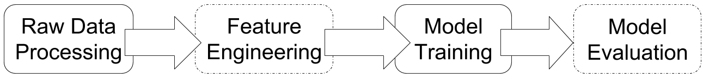

# Project Guideline

In this project, you will explore means to detect malware using machine learning (ML) algorithms trained on the basis of a voluminous dataset provided by Microsoft.
The goal is to predict if a Windows machine may get infected by certain families of malware. We will build an ML pipeline (see below) to accomplish this goal. This document further illustrates each step with useful materials including data, tools and scripts.




## ML Tools
First, you should get familiar with several useful tools.

* [Python 3](https://www.python.org/downloads/): The programming language for this project is Python 3.
* [Numpy](http://www.numpy.org/): NumPy is the fundamental package for scientific computing with Python, but we will mostly use it as an efficient multi-dimensional container of generic data.
* [Pandas](https://pandas.pydata.org/): Pandas is a Python library providing high-performance, easy-to-use data structures and data analysis tools. For this project, you will definitely use its convenient `read_csv()` API among many other useful functions.
* [Scikit-Learn](https://scikit-learn.org/stable/index.html): A simple and efficient toolset containing many ML algorithms. We will use several ML models implemented in this package, e.g., RandomForestClassifier and GradientBoostingClassifier.
* (Optional) [XGBoost](https://xgboost.readthedocs.io/en/latest/index.html): XGBoost is an advanced package for GradientBoosting comparing to sklearn's GradientBoosting. You are encouraged to use it for tuning high performance gradient boosting models.
* [Keras](https://keras.io/): is a convenient deep neural network package written in Python and runs on top of TensorFlow.


## Dataset Processing
Our raw dataset is available at [Kaggle](https://www.kaggle.com/c/microsoft-malware-prediction/data). You can either download manually from the website by clicking the link above, or pull it using kaggle’s command-line API:
```
kaggle competitions download -c microsoft-malware-prediction
```
The data set is around 7.8 GB (2.5 GB if compressed).
Read the data description to get a rough view of the structure of the data.
Essentially, it is a table where each row depicts a machine.
In the training dataset (train.csv), we know if the machine is already infected by certain malware;
while in the testing dataset (test.csv), we do not know the infection status and thus need to make a prediction for each machine.
As ML algorithms usually take numerical data as inputs, our first step is to convert the raw data into a numeric matrix X, whose dimension is the number of samples by the number of features, and a label vector Y with the size equals to the number of samples. During the process, you need to consider the following issues:

* How to split **features** (many machine properties) from **labels** (if a machine is infected)?
* How to handle missing values, or the special “NA” (not available) cases?
* How to convert categorical features (features whose values are string) to numeric? Hint: use sklearn’s [OrdinalEncoder](https://scikit-learn.org/stable/modules/generated/sklearn.preprocessing.OrdinalEncoder.html#sklearn.preprocessing.OrdinalEncoder).
* How to handle testing dataset with no labels?
* Is it necessary to cache/pickle the data that you have processed?
* Do you need to scale the features? Hint: e.g., [min-max scaling](https://scikit-learn.org/stable/modules/generated/sklearn.preprocessing.MinMaxScaler.html) or [zero-mean scaling](https://scikit-learn.org/stable/modules/generated/sklearn.preprocessing.StandardScaler.html#sklearn.preprocessing.StandardScaler)

Technically, your task in this step is to implement several functions defined in `data_process.py`.
Below is the major function that processes the .csv data file:
```python
def processDataset(filename, hasLabel=True, portions=[0.1]):
    """Properly process the .csv file named @filename.
    Args:
        filename: name of the .csv file, NOT including the '.csv' extension.
        hashLabel: true if the file has label (training data), otherwise false.
        portions: list of floats, at the end of the data processing,
                  for each x in portions, pickling 100*x% of the data.
    Returns:
        X, a numpy matrix of size #samples x #features
        Y, if @hasLabel is True, a numpy array of size #samples, otherwise None.
        featureNames, the corresponding name of X's each column.
    """
    raise NotImplementedError()
```
The number of samples in train.csv is huge, i.e., 8,921,483 in total.
We will only use 1% of the data (89,215) to play around with several ML algorithms.
Implement the following function to randomly sample 1% of the entire dataset and cache the results into a pickle file.
```python
def pklDataPortion(X, Y, featureNames, pklname, portion=0.1):
    """Given the entire dataset (X, Y), randomly pick @portion% of the data from it,
    and pickles the sampled data into the file named @pklname.
    Args:
        X, a numpy matrix, size = #samples x #features
        Y, a numpy array, size = #samples
        featureNames, the corresponding name of each column in X
        pklname, where the pickled data should be written to
        portion, pickle only part of the dataset
    """
    raise NotImplementedError()
```
`train_samples.csv` is a data sample file smaller than 1% of the provided dataset (i.e., 4,000 rows only), and you can use it during your coding for debugging.

## Feature Engineering
There are many ways to engineer features in the dataset before fitting a model with the dataset.
In this project, we will use an informal way to get the importance of each raw features from decision-tree-based models.
You can get a score of a feature's importance from most decision-tree-based ensemble models (e.g., RandomForestClassifier and GradientBoostingClassifier).
Implement the following function in `cross_valid.py` to rank features using the information provided by a trained classifier:
```python
def rankFeatures(clf, featureNames, top=10):
    """Given a trained classifier that is able to rank features,
    sort the feature names in @featureNames, and print several top features.
    Args:
        cls: a fitted classifier having the scores of feature importance.
        featureNames: names of the features.
        top: how many top features to print to the stdout.
    Returns:
        sortedFeatures, feature names sorted by its importance.
        sortedFeatureImportances, the scores for each item in sortedFeatures.
    """
    raise NotImplementedError()
```


## Model Training
Before diving into ML models, we'd better understand how to evaluate a model's performance.
The candidate metrics are accuracy, precision, recall, F1 score, and AUC score. To calculate the metrics, you can google their maths definition and implement your own functions or just use sklearn's simple [APIs](https://scikit-learn.org/stable/modules/model_evaluation.html#model-evaluation).
You will need to decide which metrics to use and why.
Let us use accuracy (accu) as an example for illustration purpose hereafter.

### Cross Validation (CV)
We will adopt the cross-validation technique for evaluating models.
By splitting the dataset into `k` folds, we can run `k` rounds of train-valid procedures where the validation set in each round is unique.
In the train-valid procedure, we fit the model with `k-1` folds of data and evaluate the model using the rest 1 fold of data.
Your will need to implement the cross-validation procedure in `cross_valid.py` as follows:
```python
def crossValidate(clf, X, Y, featureNames, trainFunc, fold=5):
    """Cross validate using stratified k-fold split.
    Args:
        clf: a sklearn classifier of any type.
        (X, Y): feature matrix and label vector from the dataset.
        featureNames: column names of @X.
        tranFunc: a function object that implements how to fit @clf.
        fold: number of fold to run for cross validation.
    Returns:
        Metrics on each validation fold as a dictionary, e.g.,
            result['ValidAccuList'] = [accu_1, accu_2, ..., accu_k]
            result['ValidLossList'] = [loss_1, loss_2, ..., loss_k]
            ...
    """
    raise NotImplementedError()
```
You may find [StratifiedKFold](https://scikit-learn.org/stable/modules/generated/sklearn.model_selection.StratifiedKFold.html) useful when implementing cross validation.

### Ensemble Learning Based Models
Ensemble learning based models can achieve good results in many classification problems.
In this project, we will try two of them.
The first model, defined in `cv_rf.py`, is [RandomForestClassifier](https://scikit-learn.org/stable/modules/generated/sklearn.ensemble.RandomForestClassifier.html).
Your task is to implement the following function used as the trainFunc function object in `crossValidate`:
```python
def trainRandomForest(clf, trainX, trainY, validX, validY,
                      featureNames, k=0, top=10):
    """How to train a random forest classifier.
    Args:
        clf: expect to be a sklearn RandomForestClassifier object.
        (trainX, trainY, validX, validY): splitted train/valid dataset.
        featureNames: column names of @trainX and @validX.
        k: indicator of which round of cross validation.
        top: print top-x features.
    Returns:
        clf: fitted classifier.
        trainAccu: final training accuracy.
        validAccu: final validation accuracy.
    """
    raise NotImplementedError()
```
Note that the parameter `top` in `trainRandomForest` is meaningless when not doing feature engineering.

Once done, it should be straightforward to measure the cross-validation performance of [GradientBoostingClassifier](https://scikit-learn.org/stable/modules/generated/sklearn.ensemble.GradientBoostingClassifier.html) with the following function in `cv_gbt.py`. You will need to complete the implementation:
```python
def trainGradientBoost(clf, trainX, trainY, validX, validY,
                       featureNames, k=0, top=5):
    """How to train a gradient boosting classifier.
    Args:
        clf: expect to be a sklearn GradientBoostingClassifier object.
        (trainX, trainY, validX, validY): splitted train/valid dataset.
        featureNames: column names of @trainX and @validX.
        k: which round of cross validation.
        top: print top-x features.
    Returns:
        clf: fitted classifier.
        trainAccu: final training accuracy.
        validAccu: final validation accuracy.
    """
    raise NotImplementedError()
```

You will explore how to improve the average performance of your validation metric(s) for different models, and compare their best performance.

Now pick a model implemented by sklearn and test it out with this dataset.
Explain why you pick the model, and report its cross-validation score (e.g., accuracy, F1 score, AUC score).

### Possible next steps

Below are two directions you can go after finishes ensemble learning. Feel free to add your own thoughts in the proposal. 

1. Explore deep neural network models in Keras

2. Further model evaluation
Train your best model with the entire training dataset, or a much larger portion of it.
Then do a prediction over the testing dataset (you need to process the testing dataset first).
Submit your prediction results to [Kaggle](https://www.kaggle.com/c/malware-classification).

### Bonus

Let me know if you are interested in participate in the [Microsoft Malware Prediction contest](https://www.kaggle.com/c/microsoft-malware-prediction?utm_medium=email&utm_source=intercom&utm_campaign=microsoft_malware_comp_mailer). We can provide more guidance and GPU servers.
